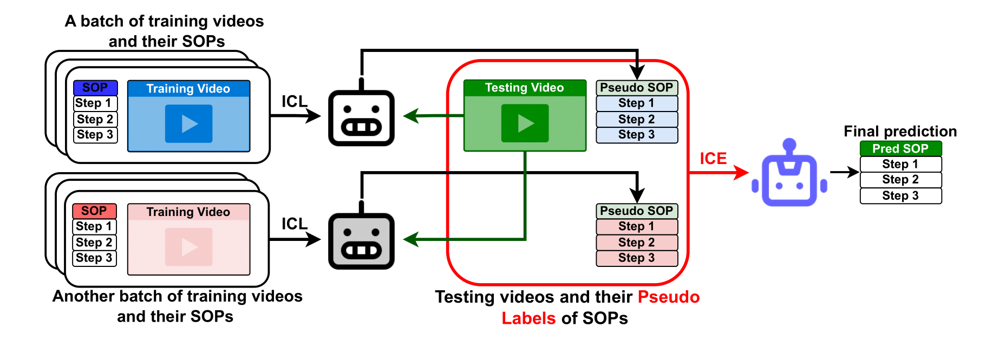
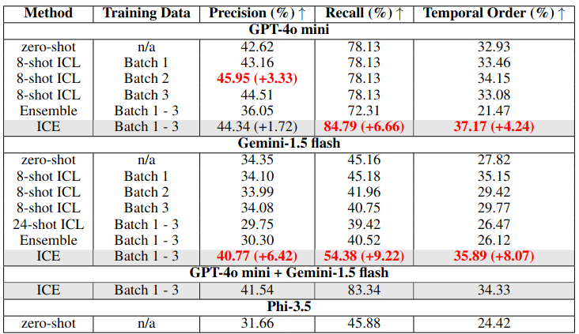

# Introduction
This is an implementation of the paper **In-Context Ensemble Improves Video-Language Models for Low-Level Workflow Understanding from Human Demonstrations**. 

# Abstract
**SOP Generation Task:** A Standard Operating Procedure (SOP) defines a low-level, step-by-step written guide for a business software workflow based on a video demonstration. SOPs are a crucial step toward automating end-
to-end software workflows. Manually creating SOPs can be time-consuming. Recent advancements
in large video-language models offer the potential for automating SOP generation by analyzing
recordings of human demonstrations. However, current large video-language models face challenges
with zero-shot SOP generation. We explore in-context learning with video-language models for
SOP generation. We report that in-context learning sometimes helps video-language models at SOP
generation. We then propose an in-context ensemble learning to further enhance the capabilities of
the models in SOP generation. 

**Multimodal In-Context Ensemble (ICE):** Our proposed in-context ensemble learning provides the video-language models with video inputs, along with text-based pseudo labels of actions, enabling the models to learn from more examples beyond their context window limit, with a regularisation effect. The pipeline is illustrated in below:


# Features
- Support zero-shot, few-shot, ensemble, multimodal in-context ensemble with OpenAI [GPT-4o](https://openai.com/index/gpt-4o-mini-advancing-cost-efficient-intelligence/)
- Support zero-shot, few-shot, ensemble, multimodal in-context ensemble with Google [Gemini](https://deepmind.google/technologies/gemini/flash/)
- Support zero-shot, few-shot, ensemble, multimodal in-context ensemble with public [CogAgent2](https://github.com/THUDM/CogVLM2)
- Support zero-shot, few-shot, ensemble, multimodal in-context ensemble with Microsoft [Phi3.5](https://huggingface.co/microsoft/Phi-3.5-vision-instruct)

# Context & Structure
- [**analysis**](./analysis/): the folder containing the code we used for results analysis
- [**configs**](./configs/): the folder containing config files we used for SOP generation with different models
- [**configs_ensemble**](./configs_ensemble/): the folder containing config files we used for different ensembles with different models
- [**data_preprocessing**](./data_preprocessing/): the folder containing data downloading, train/test data split
- [**data_splits**](./data_splits/): the folder containing the data splits txts we used in our paper
- [**ensembles**](./ensembles/): the folder containing the code for ensemble and in-context ensemble
- [**evals**](./evals/): the folder containing the code for evaluation of generated SOPs against gold SOPs
- [**icls**](./icls/): the folder containing the code for different models in SOP generation
- [**main.py**](./main.py): the main file for calling different models in icls for SOP generation
- [**helpers.py**](./helpers.py): the code containing small supporting functions
- [**exp.sh**](./exp.sh): the bash file for running SOP generation experiments in linux
- [**exp_icl.sh**](./exp_icl.sh): the bash file for running different batches of multimodal in-context learning in linux

# Results
Beneath is the testing results on 507 videos from the "Gold Demo" subset of WONDERBREAD benchmark. Our evaluation is more challenging than the original one as we only feed videos into the models, *without* trace information (e.g. mouse clicks). **ICL**: in-context learning. **ICE**: in-context ensemble. **Ensemble**: majority voting of pseudo labels:

<!--  -->
| **Method** | **Training Data** | **Precision (%)**  | **Recall (%)**  | **Temporal Order (%)** |
|------------|-------------------|-----------------------------|--------------------------|-----------------------------------|
| **GPT-4o mini** | 
| zero-shot  | n/a               | 42.62                       | 78.13                    | 32.93                             |
| 8-shot ICL | Batch 1           | 43.16                       | 78.13                    | 33.46                             |
| 8-shot ICL | Batch 2           | <span style="color:red">**45.95 (+3.33)</span>**           | 78.13                    | 34.15                             |
| 8-shot ICL | Batch 3           | 44.51                       | 78.13                    | 33.08                             |
| Ensemble   | Batch 1 - 3       | 36.05                       | 72.31                    | 21.47                             |
| **ICE (Ours)**    | Batch 1 - 3       | 44.34 (+1.72)               | <span style="color:red">**84.79 (+6.66)**</span>        | <span style="color:red">**37.17 (+4.24)**</span>                 |
| **Gemini-1.5 flash** |
| zero-shot  | n/a               | 34.35                       | 45.16                    | 27.82                             |
| 8-shot ICL | Batch 1           | 34.10                       | 45.18                    | 35.15                             |
| 8-shot ICL | Batch 2           | 33.99                       | 41.96                    | 29.42                             |
| 8-shot ICL | Batch 3           | 34.08                       | 40.75                    | 29.77                             |
| 24-shot ICL| Batch 1 - 3       | 29.75                       | 39.42                    | 26.47                             |
| Ensemble   | Batch 1 - 3       | 30.30                       | 40.52                    | 26.12                             |
| **ICE (Ours)**    | Batch 1 - 3       | <span style="color:red">**40.77 (+6.42)**</span>           | <span style="color:red">**54.38 (+9.22)**</span>        | <span style="color:red">**35.89 (+8.07)**</span>                 |
| **GPT-4o mini + Gemini-1.5 flash** |
| **ICE (Ours)**    | Batch 1 - 3       | 41.54                       | 83.34                    | 34.33                             |
| **Phi-3.5** |
| zero-shot  | n/a               | 31.66                       | 45.88                    | 24.42                             |

# Installment
For using GPT-4o-mini and Gemini-1.5-flash, please install the libraries with [`requirements.txt`](./requirements.txt):
```bash
pip install virtualenv
cd your_project_directory
virtualenv venv
virtualenv -p python venv
python3 -m venv venv
source venv/bin/activate
pip install -r requirements.txt
```
For the additional use of public models, Phi-3.5 and CogAgent2, please also install extra libraries with [`requirements-cogagent.txt`](./requirements-cogagent.txt):
```bash
source venv/bin/activate
pip install --ignore-installed -r requirements-cogagent.txt
```

# Data
The [**WONDERBREAD**](https://hazyresearch.stanford.edu/wonderbread-website/) benchmark contains 2928 videos of distinct workflows and their SOPs. We use a subset called "Gold Demos" of 724 videos. We split (random seed 42) the data into two parts, 30\% training (217 videos) and 70\% testing (507 videos). We subsequently split the training data into 28 batches, each batch contains 8 videos. Our split can be found in [`data_split`](./data_splits/). Our data preprocessing including data downloading is in [`data_preprocessing/`](./data_preprocessing/). In the dataset, the videos and their SOPs are organised as in the following:
```
Wonderbread_gold_demos/
│
├── 0 @ 2023-12-25-15-10-58/
│   ├── screenshots/
│   │   ├── 0.png
│   │   ├── 1.png
│   │   ├── 2.png
│   │   ├── ...
│   |── SOP - 0 @ 2023-12-25-15-10-58.txt
├── 0 @ 2023-12-25-16-43-12/
├── 1 @ 2023-12-25-15-44-04/
...
```

# Quickstart for SOP generation
1. Download the data via [`data_preprocessing/download_wonderbread.sh`](./data_preprocessing/download_wonderbread.sh). You can use the provided [`data_splits`](./data_splits/) in your config.
2. Choose a config template in [`configs`](./configs/) and change the data paths and hyper-parameters within that config. Then run the main function with the config file:
```bash
cd your_own_working_directory_of_this_repository
python main.py --config configs/gpt4omini.yml
```

# Evaluation
1. Change the results paths and ground truth path in:
 [`evals/eval.py`](./evals/eval.py).
2. Export your openai key:
```
export OPENAI_API_KEY="some-some-key"
```
3. Run the following code within the evals folder:
```
cd your_own_working_directory_of_this_repository
cd evals
python evals/eval.py
```
**Metrics**: Precision measures how many steps in the prediction match those in the gold standard SOP. Recall measures how many steps of the gold standard SOP are included in the predictions. Temporal order evaluates whether the sequence of steps in the prediction aligns with the sequence in the gold standard SOP.

# Acknowledgement & Contacts
**Moucheng Xu**: Conceptualization, Methodology, Project administration, Implementation, Integration, Data, Experiments, Formal analysis, Writing of the manuscript. **Evangelos Chatzaroulas**: Implementation of ICL with Phi-3.5 and CogAgent, Data, Experiments, Writing of the manuscript. **Luc McCutcheon**: Implementation of ICL with Gemini-1.5-flash, Writing of the manuscript. **Abdul Ahad, Hamzah Azeem, Janusz Marecki, Ammar Anwar**: Resources, Writing of the manuscript. 

Our LLM based evaluation code is borrowed from: [wonderbread](https://github.com/HazyResearch/wonderbread/blob/main/wonderbread/benchmark/tasks/documentation/sop_generation/eval.py)

Contact [Moucheng Xu](https://scholar.google.com/citations?hl=en&user=7uJJaLIAAAAJ&view_op=list_works) for any questions: xumoucheng28@gmail.com

<!-- ## Citation
Please consider citing the following if you found this work or code helpful!

```
@article{zhou2023webarena,
  title={WebArena: A Realistic Web Environment for Building Autonomous Agents},
  author={Zhou, Shuyan and Xu, Frank F and Zhu, Hao and Zhou, Xuhui and Lo, Robert and Sridhar, Abishek and Cheng, Xianyi and Bisk, Yonatan and Fried, Daniel and Alon, Uri and others},
  journal={arXiv preprint arXiv:2307.13854},
  year={2023}
}
``` -->